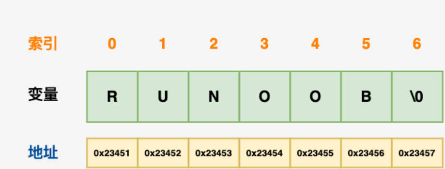
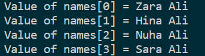
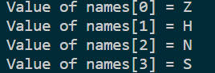
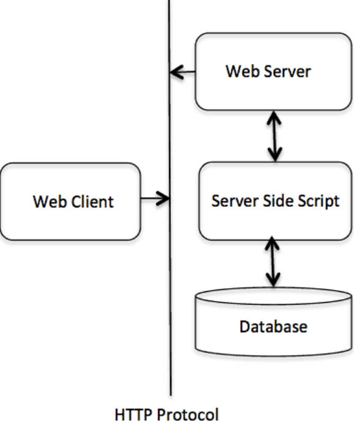

# C++

## 0.安装

教程网址：[C++ 菜鸟教程](https://www.runoob.com/cplusplus/cpp-tutorial.html)

资源导航：[C++ 资源](https://www.runoob.com/cplusplus/cpp-useful-resources.html)

编译器安装：[Windows 下安装 mingew-w64](https://ai.52learn.online/1814)

**编写 C 程序选择 gcc.exe，C++ 则选择 g++.exe**；模式选择 **windows-gcc-x64**

解决中文乱码问题：

**1.在 output 窗口输出设置**

往 `task.json` 中的`args` 数组添加 `"-fexec-charset=gbk",`

**2.在终端打开设置**

[参考教程](https://www.bilibili.com/read/cv11997883/)

设置 **runner code** 插件，在终端窗口打开

往 `settings.json` 中添加 `"-fexec-charset=gbk",`


**Code Runner:** `Ctrl + Alt + n` 编译快捷键

## 1.简介

[C++ 代码风格指南](https://zh-google-styleguide.readthedocs.io/en/latest/google-cpp-styleguide/)

**特点**

静态类型：在编译时执行类型检查，而不是在运行时执行类型检查

编译式的、通用的、**大小写敏感**、不规则的编程语言，支持过程化编程、面向对象编程和泛型编程。

综合了高级语言和低级语言的特点--也被称为中级语言

**历史**

C++ 是由 Bjarne Stroustrup 于 1979 年在新泽西州美利山贝尔实验室开始设计开发的。C++ 进一步扩充和完善了 C 语言，最初命名为带类的C，后来在 1983 年更名为 C++。

**标准库**

标准的 C++ 由三个重要部分组成：

- 核心语言，提供了所有构件块，包括变量、数据类型和常量，等等。
- C++ 标准库，提供了大量的函数，用于操作文件、字符串等。
- 标准模板库（STL），提供了大量的方法，用于操作数据结构等。

**程序编写和执行的流程**

文本编辑器：在其中编写人类可读的源文件

C++ 编译器：将源文件编译为机器可以识别的机器语言，最终由 CPU 执行指令

## 2.基础

### 2.1 数据类型和变量类型

**数据类型**

- 无类型：`void`

- 宽字符型：`wchar_t`，由来：`typedef short int wchar_t`，与 `short int` 一样

- 枚举类型：

```c++
/* 
enum 枚举名{ 
       标识符[=整型常数], 
       标识符[=整型常数], 
  ... 
      标识符[=整型常数]
  } 枚举变量;
*/

//默认情况下，第一个名称的值为 0，第二个名称的值为 1，第三个名称的值为 2
enum color { red, green, blue } c;
```

**变量类型**

声明：

```c++
// 变量声明
extern int a, b;
extern int c;
extern float f;

//函数声明
int func();
```

**左值 (Lvalues) 和右值 (Rvalues)**

左值：指向内存位置的表达式，如变量，可以出现在赋值号的左边或右边。

右值：存储在内存中的数值，如确切数字，只能在右边。

**变量作用域**

当局部变量被定义时，系统不会对其初始化，您必须自行对其初始化。定义全局变量时，系统会自动初始化为下列值：

| 数据类型 | 初始化默认值 |
| :------- | :----------- |
| int      | 0            |
| char     | '\0'         |
| float    | 0            |
| double   | 0            |
| pointer  | NULL         |

**常量**

1.使用 **#define** 预处理器定义常量

又称为字面量，是固定的值。    

2.使用 **const** 前缀声明指定类型的常量

```c++
#1.定义常量的方式：define identifier value
#define LENGTH 10  

#2.const type variable = value;
const int  LENGTH = 10;
```

**修饰符类型**

使用速记符号来声明**无符号短整数**或**无符号长整数**。您可以不写 int，只写单词 **unsigned、short** 或 **long**，**int** 是隐含的。

```c++
#胜率式写法
unsigned x;
#完整写法
unsigned int x;
```

### 2.2 存储类

`auto` 关键字：声明变量时根据初始化表达式自动推断该变量的类型。

`static` 修饰**局部变量**可以在函数调用之间保持局部变量的值，不会在退出时销毁。**而修饰全部变量时，会使变量的作用域限制在声明它的文件内。**

`extern` 修饰符用于两个或多个文件共享相同的全局变量或函数的时候。

**switch 语句**

`switch(expression)`，其中 `expression` 必须是一个整型或枚举类型。

```c++
switch(grade)
{
    case 'A':
        cout << "优秀" << endl;
        break;
    case 'B':
        cout << "良好" << endl;
        break;
    default:
        cout << "错误" << endl;
}
```

**条件运算符**

if 语句的“简写”

```c++
var = (y < 10) ? 30 : 40;
```

### 2.3 函数

每个 C++ 程序都至少有一个函数，即主函数 **main()**

在函数声明中，参数的名称并不重要，只有参数的类型是必需的：

```c++
int max(int num1, int num2);
//简写形式
int max(int, int);
```

- 传值调用，把参数的实际值传给函数的形参，修改形参对实际值无影响
- 指针调用和引用调用，形参的改变对实参有影响

**Lambda 表达式**

### 2.4 字符串

字符串实际就是以“空字符”结尾的一维字符数组，如 `char site[] = "RUNOOB";`，定义时会自动在后面加上空字符 `\0`。



### 2.5 引用

已经存在的变量的别名，通过 `&` 实现，引用须在创建时初始化。

变量是附属在内存位置中的标签，而引用是第二个标签。一些情况，通过引用代替指针，可使得程序易读。

```c++
int i = 17;
//引用
int&  r = i;
double& s = d;
```

### 2.6 指针

可通过连字号（&）运算符访问的地址。

```c++
int  var1;
cout << "var1 变量的地址： ";
cout << &var1 << endl;
```

**指针的类型：**

若**ptr** 是整型的指针，则 ptr 每增加一次，它都将指向下一个整数位置，即当前位置往后移 4 个字节。

```c++
int    *ip;    /* 一个整型的指针 */
double *dp;    /* 一个 double 型的指针 */
float  *fp;    /* 一个浮点型的指针 */
char   *ch;    /* 一个字符型的指针 */
```

- **空指针**：在变量声明的时候，如果没有确切的地址可以赋值，可为指针变量赋一个 NULL 值，NULL 指针是一个定义在标准库中的值为零的常量。
- **指针的算术运算**：在程序中使用指针代替数组，因为变量指针可以递增，而数组不能递增。
- **指向指针的指针**：`int **ptr`

```c++
//1.空指针
int  *ptr = NULL;

//2.算术运算
int  var[3] = {10, 100, 200};
int  *ptr;
ptr = var;
for (int i = 0; i < 3; i++){
    //var[i]的地址
	cout << ptr << endl;
    //var[i]的值
    cout << *ptr << endl;
    //移动到下一个位置
    ptr++
}
ptr <= &var[MAX - 1] //指针的比较
```

- **指针数组**：`int *ptr[MAX];\\指向整数的指针数组 `

```c++
#include <iostream>
 
using namespace std;
const int MAX = 4;
 
int main ()
{
  //每个指针对应字符串中的首地址
  const char names*[MAX] = {
                   "Zara Ali",
                   "Hina Ali",
                   "Nuha Ali",
                   "Sara Ali",
   };
   for (int i = 0; i < MAX; i++)
   {
      cout << "Value of names[" << i << "] = ";
       //1.方式一的取值
      cout << names[i] << endl;
       //2.方式二的取值
      //cout << *names[i] << endl;
   }
   return 0;
}
```

输出结果的不同：

1. 不带星号的取值，输出完整的字符串，相当于直接用数组的头部地址

   

2. 带星号的取值，取出的是数组头部地址对应的字母

   

### 2.7 结构体

```c++
struct Books
{
   char  title[50];
   char  author[50];
   char  subject[100];
   int   book_id;
} book;
```

结构体类型：Books；结构体变量名：book (类比于对象中定义)

```c++
Books Book1;        // 定义结构体类型 Books 的变量 Book1
strcpy( Book1.title, "C++ 教程");
Book1.id=1234;

struct Books *struct_pointer;
//访问形式
struct_pointer->title
```

## 3.进阶

### 3.1 文件和流

从文件读取和写入流：标准库 **fstream**，该标准库定义了 3 个新的数据类型。

- `ofstream`：输出文件流，创建并写入信息
- `ifstream`：输入文件流，从文件读取信息
- `fstream`：兼有上面两种功能

C++ 程序终止时，它会自动关闭刷新所有流，释放所有分配的内存，并关闭所有打开的文件，但最好养成好习惯。

```c++
ofstream outfile;
//打开文件用于读：out 和写：in
outfile.open("file.dat",  ios::out | ios::in );
outfile.close();
//写入数据
outfile << data << endl;
//关闭文件
outfile.close();
```

### 3.2 动态内存

**栈：**在函数内部声明的所有变量都将占用栈内存。

**堆：**程序中未使用的内存，在程序运行时可用于动态分配内存。

可使用 **new** 运算符为给定类型的变量在运行时分配堆内的内存——返回所分配的空间地址。最后可以使用 **delete** 运算符，删除之前由 new 运算符分配的内存。

**malloc()** 在 C++ 中仍然存在，但建议尽量不要使用 malloc() 函数。new 与 malloc() 函数相比，其主要的优点是，new 不只是分配了内存，它还创建了对象。

如果自由存储区已被用完，可能无法成功分配内存。所以建议检查 new 运算符是否返回 NULL 指针。

```c++
double* pvalue  = NULL;
if( !(pvalue  = new double ))
{
   cout << "Error: out of memory." <<endl;
   exit(1);
}
delete pvalue;         // 释放内存
```

**数组动态内存分配**

```c++
char* pvalue  = NULL;   // 初始化为 null 的指针
pvalue  = new char[20]; // 为变量请求内存
delete [] pvalue;        // 删除 pvalue 所指向的数组
```

### 3.3 命名空间

命名空间：作为附加信息来区分不同库中相同名称的函数、类、变量等。本质上，命名空间就是定义了一个范围。

为了调用待命名空间的函数或变量，需要在前面加上空间名称 `name::code; `

```c++
//命名空间使用关键字 namespace 
namespace namespace_name{   
}
//实例演示
// 第一个命名空间
namespace first_space{
   void func(){
      cout << "Inside first_space" << endl;
   }
}
// 第二个命名空间
namespace second_space{
   void func(){
      cout << "Inside second_space" << endl;
   }
}
 // 调用第一个命名空间中的函数
   first_space::func(); 
 // 调用第二个命名空间中的函数
   second_space::func(); 
```

**using namespace 指令**

这个指令会告诉编译器，后续的代码将使用指定的命名空间中的名称，因此可在使用命名空间时不用在前面加上命名空间的名称。

```c++
namespace first_space{
   void func(){
      cout << "Inside first_space" << endl;
   }
}
// 调用第一个命名空间中的函数
using namespace first_space;
int main ()
{   
   func();
   return 0;
}
```

### 3.4 模板

模板是泛型编程的基础，泛型编程即以一种独立于任何特定类型的方式编写代码。

```c++
//1.函数模板的一般形式
template <typename type> ret-type func-name(parameter list){  }
//实例  
template <typename T>
inline T const& Max (T const& a, T const& b) 
{ 
    return a < b ? b:a; 
} 

//2.类模板的一般形式
template <class type> class class-name { }
//实例
template <class T>
class Stack { 
  private: 
    vector<T> elems;     // 元素 
 
  public: 
    void push(T const&);  // 入栈
    void pop();               // 出栈
    T top() const;            // 返回栈顶元素
    bool empty() const{       // 如果为空则返回真。
        return elems.empty(); 
    } 
}; 
```

### 3.5 预处理

在实际编译之前需要完成的预处理，预处理不是 C++ 语句，并不以分号结尾。

`#define` 预处理指令用于创建符号常量，该符号常量通常称为**宏**。

```c++
#define PI 3.14159
//参数宏
#define MIN(a,b) (a<b ? a : b)
```

- **#** 字符串化的意思，出现在宏定义中的#是把跟在后面的参数转换成一个字符串。
- **##** 连接符号，把参数连在一起。

```c++
//# 用法
#define MKSTR( x ) #x
//将 HELLO C++ 转换为  "HELLO C++"
MKSTR(HELLO C++)
    
//## 用法
#define concat(a, b) a ## b
//将concat(x,y) 变为: xy
concat(x, y);
```

**多线程：**

- 基于进程的多任务处理是程序的并发执行
- 基于线程的多任务处理是同一程序片段的并发执行

### 3.6 Web 编程

**CGI**

公共网关接口 (Common Gateway Interface，CGI)，是一套标准，定义了信息如何在 Web 服务器和客户端脚本之间进行交换。



## 4.面向对象

### 4.1 类定义

类是 C++ 的核心特性：

- 可以定义在类定义内部 / 或在类的外部使用**范围解析运算符 ::** 函数在，需要注意的是 **:: 运算符之前必须使用类名**。
- 类访问修饰符，关键字 **public、private、protected** 称为访问修饰符。
  - 默认情况下，类的所有成员都是私有的 **private**，一般会在私有区域定义数据，在公有区域定义相关的函数，且 **private** 只能被本类成员（类内）和友元访问，不能被派生类访问。
  - **protected（受保护）**成员变量或函数与私有成员十分相似，但 protected（受保护）成员在派生类（即子类）中是可访问的。

```c++
class calss_name{
    //访问修饰符,private,protected,public
    //变量
    //方法
    //分号结束类
    public:
    double length;
    double get(void)
    void set(double len, int bre)
    
};
//成员函数的定义
double Box::get(void)
{
    return length * breadth * height;
}
void Box::set( double len, double bre)
{
    length = len;
    breadth = bre;
}
```

三类继承方式：

**未使用访问修饰符 ( access-specifier) 则默认为 private**

```c++
class B : public A  
class B : protected A
class B : private A
```

| 继承方式      | 基类的public成员  | 基类的protected成员 | 基类的private成员 | 继承引起的访问控制关系变化概括         |
| :------------ | :---------------- | :------------------ | :---------------- | :------------------------------------- |
| public继承    | 仍为public成员    | 仍为protected成员   | 不可见            | 基类的非私有成员在子类的访问属性不变   |
| protected继承 | 变为protected成员 | 变为protected成员   | 不可见            | 基类的非私有成员都为子类的保护成员     |
| private继承   | 变为private成员   | 变为private成员     | 不可见            | 基类中的非私有成员都称为子类的私有成员 |

- public 继承后属性不变
- protected 继承后都为保护成员

### 4.2 继承

重用代码功能和提高执行效率，已有的类称为**基类**，新建的类称为**派生类**。

**多继承**：继承了多个父类的特性。`class Rectangle: public Shape, public PaintCost`

**运算符重载和重载函数**

函数或方法名称相同，但是参数列表和定义不同。

可以重载大部分的运算符，这样就能使用自定义类型的运算符。

**多态**

多个不同类带有同一个名称但具有不同实现的函数，函数的参数也可以相同。在基类中定义的同名称函数已经被设置好，即所谓的**静态多态**或**静态链接**，有时也称为**早绑定**。派生类(子类)执行相同名称的函数时，则会调用基类中的函数。

**虚函数**

为了避免上述的情况，可在函数前加上 **virtual**，变为虚拟函数。虚函数的使用就是不要静态链接到该函数，从而在程序中任意点根据所调的对象类型选择调用的函数，该操作被称为**动态链接**，**后期绑定**。

纯虚函数：`virtual int area() = 0;` 在基类中不能给出有意义的实现，无函数主体。

`virtual` 修饰符强调父类的成员函数可以在子类中被**重写**，因为重写之时并没有与父类发生任何的调用关系，故而重写是被允许的。

编译器不检查虚函数的各类属性。被 `virtual` 修饰的成员函数，不论他们是private、protect或是public的，都会被统一的放置到虚函数表中。对父类进行派生时，子类会继承到拥有相同偏移地址的虚函数表，则子类就会被允许对这些虚函数进行重载。且重载时可以给重载函数定义新的属性，例如public，其只标志着该重载函数在该子类中的访问属性为public，和父类的private属性没有任何关系！

**纯虚函数**可以设计成私有的，不过这样不允许在本类之外的非友元函数中直接调用它，子类中只有覆盖这种纯虚函数的义务，却没有调用它的权利。

**总结**

定义一个函数为虚函数，不代表函数为不被实现的函数。

定义为虚函数是为了允许用基类的指针来调用子类的这个函数。

定义一个函数为纯虚函数，才代表函数没有被实现。

定义纯虚函数是为了实现一个接口，起到一个规范的作用，规范继承这个类的程序员必须实现这个函数。


## 3.头文件说明

### 3.1`<cmath>`

数学头文件，可直接使用相应的数学函数：

- **double pow(double, double);**
- **int abs(int);**

### 3.2`<cstring>`

字符串直接使用的函数：

- **strlen(s1);** 返回字符串长度
- **strcat(s1, s2);** 连接字符串
- **strcmp(s1, s2);** 比较字符串
- **strcpy(s1, s2);** 复制字符串 s2 到字符串 s1。

注意：对象形式，`#include <string>`  中 string 类型支持所有操作。

### 3.3 `<iostream>`

基本的输入输出，该头文件定义了 **cin、cout、cerr** 和 **clog** 对象，分别对应于标准输入流、标准输出流、非缓冲标准错误流和缓冲标准错误流。

- **count**：与流插入运算符 `<< ` 配合使用
- **cin**：与流提取运算符 `>>` 结合使用


### 3.2`<cstdlib>`

