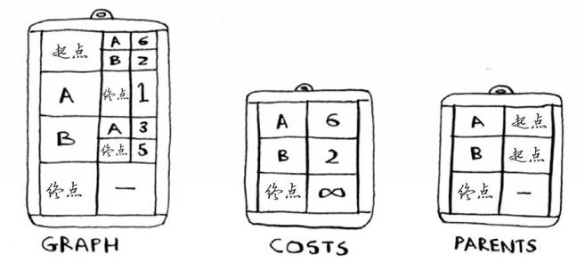
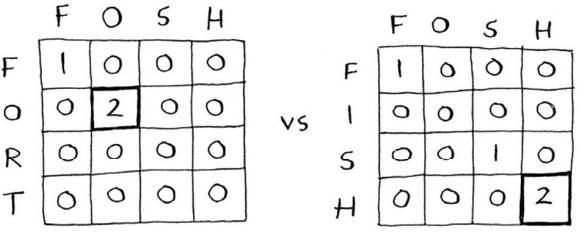

## 算法图解

### 0.算法简介

算法运行多少时间和运行时间随列表增长而增加。

大 O 表示法，指出算法能够执行的操作数

- 简单查找：O(n)
- 二分查找：O(log n)
- 排序算法：O(n * logn)
- 选择排序：O($n^2$)

算法速度指的并非时间，而是操作数的增速。即谈论算法的速度时，一般看随着输入的增加，其运行时间将以什么样的速度增加。

#### **0.1二分查找**

输入是一个有序的元素列表

对于包含 $n$ 个元素的列表，用二分查找最多需要 $\log_2n$ 步，

#### **0.2旅行商问题-TSP**

描述：旅行商前往 5 个城市，同时确保旅途最短，需考虑前往这些城市可能的顺序

解决：O(n!)，记录最糟糕的运行时间。对于 5 个城市，其可能的排列方式有 5! = 120 种，对于 n 个城市则为 n!。

### 1.选择排序

#### **1.1数据结构-数组和链表**

数组在内存中紧密相连，元素的为值称为索引，如元素 20 位于索引 1 处，**同一个数组中，元素的类型应保持一致。**

链表在内存中可以任意放置

**中间插入元素**：链表的表现优于数组，链表只需修改前面元素指向的地址，而数组往往需要整体移动。

**数组和链表相关操作的运行时间**

- 读取：数组--O(1)；链表--O(n)
- 插入：数组--O(n)；链表--O(1)
- 删除：数组--O(n)；链表--O(1)

一般情况下，还是数组运用的较多。因为其支持随机访问，而链表只支持顺序访问。

#### 1.2选择排序

对学生的分数按照从大到小排序，做法是：

- 遍历整个列表，找出分数最高的学生，并将其添加到一个新的列表中
- 同上，找出分数第二高的学生也添加到新的列表中
- 最后形成一个新的有序列表

时间复杂度为：$O(n×n)=O(n^2)$，需要注意的是，随着排序进行，每次旧列表的检查元素越来越少。即第 1 次为 n，后续分别为 n-1，n-2，...，1。平均每次的检查时间为 $n/2$ ，运行时间计算为：$O(n/2×n)=O(n^2/2)$，但是大 O 表示法省略相关的常数，直接表示为 $O(n^2)$。

### 2.递归

循环可能使得程序的性能更高，而递归的程序可能更容易理解。编写递归函数，容易形成无限循环，因此必须告诉它何时停止递归。否则，由于程序使用的栈空间有限，无限的递归最终导致空间耗尽，进而使得栈溢出而终止。

每个递归函数分为两部分：

- 基线条件(base case) ：函数不再调用自身
- 递归条件 (recursive case)：函数调用自身

#### 2.1数据结构-栈

call stack，调用栈。栈虽然方便，但是也需要付出代价：储存的信息可能占用大量的内存。因为每个函数的调用都要占用一定的内存。如果栈很高，表明计算机存储了大量函数调用的信息。

- 此时可以选择使用循环解决
- 使用尾递归

#### 2.2递归流程举例

保存未完成函数的调用状态：

编写涉及到数组的递归函数时，基线条件通常为空或只包含一个元素。

```python
def sum(list):
    if list == []:
        return 0
    return list[0] + sum(list[1:])
```


```python
def fact(x):
    if x == 1:
        return 1
    else:
        return x * fact(x-1)
```


### 3.快速排序

#### 3.1 D&C

分而治之(divide and conquer，D&C)，一种著名的递归式问题解决方法。

```python
#1.计算列表中包含的元素数
def count(list):
    if list == []:
        return 0
    else:
        return 1 + count(list[1:])

#2.找出列表中最大的数字
def find_max(list):
    if len(list) == 2:
        return list[0] if list[0] > list[1] else list[1]
    sub_max = find_max(list[1:])
    return list[0] if list[0] > sub_max else sub_max
```

#### 3.2 快速排序

如 C 语言标准库中的 qsort 函数，快速排序也使用了 D&C，使用 D&C 时，需将数组分解直到满足基线条件。

- 从数组中选择一个元素，称为基准值( pivot)
- 找到比基准值小的元素和比基准值大的元素，被称为分区( partitioning)
- 对分区进行快速排序 quicksort
- 将结果进行组合，得到排序后的值

**实现快速排序的时候，建议随机选择用作基准值的元素。**


快速排序算法的速度取决于选择的基准值。快速排序最糟糕的情况下运行时间为：$O(n^2)$，平均情况的快速排序时间为：$O(n\log n)$。而合并排序算法( merge sort)的运行时间为 $O(n\log n)$。

#### 3.3 深入大 O 表示法

表示每次的操作数，而对于每次操作所需花费的时间并没有考虑。如下，简单查找操作数为：n，二分查找的操作数为:$\log n$，每执行一次算法，耗费的时间分别为 10 毫秒和 1 秒，随着执行算法的次数变多，二者的差距逐渐变大，最终二分查找优于简单查找。


如下为在 40 亿各元素中查找，二者的查找次数分别为 40 亿次和 32 次。


**最佳情况和最糟情况**

快速排序的性能高度依赖与选择的基准值

- 最糟：数组有序，总是选择第一各元素作为基准值，此时一个子数组为空，而另一个子数组过长，导致调用栈递归过长。
- 最佳：总是选择中间元素，每个数组都很短小，调用栈递归短，可以很快得到结果。调用栈高度为： $O(\log n)$，每层需要的时间为：$O(n)$

### 4.散列表

根据商品名立刻说出价格，查找时间为 O(1)。

#### 4.1 散列函数

无论输入什么数据，都会还一个数字，即“将输入映射到数字”。

散列函数满足的要求：

- 相同输入，输出的一致性
- 不同的输入，不同的输出（理想情况，一般做不到）

结合散列函数和数组创建一种散列表( hash table)，包含额外逻辑的数据结构，散列表使用散列函数来确定元素的存储位置。散列表也被称为散列映射、映射、字典和关联数组。

#### 4.2 应用

- 网址映射到 IP 地址，DNS 解析( DNS resolution)

- 避免重复
- 用作缓存，将缓存的数据存储在散列表中，即通过页面 URL 映射到页面数据

#### 4.3 冲突和性能

**将不同的键映射到数组的不同位置的散列函数几乎不可能创建。**

冲突( collision )：给两个键分配的位置相同，即具有相同的映射。

平均情况下，散列表执行各种操作的时间都为 O(1)，被称为常量时间。常量时间表示不管数组有多大，从中获取一个元素需要的时间都是相同的。

**性能**

填装因子：散列表包含的元素数 / 位置总数。一旦填装因子大于 1 ，表示商品的数量超过数组位置，此时就需要调整长度 ( resizing )。一般来说，当填装因子大于 0.7 时，就可以调整散列表的长度。

但调整长度时花费的时间较长，因此非必要不调整。

良好的散列函数：让数组中的值呈均匀分布。

### 5.广度优先搜索

#### 5.1 广度优先搜索

图由节点 (node) 和 边(edge) 组成，用来模拟一组连接。

广度优先搜索是一种**用于图的查找算法**，可解决两类问题：

- 从节点 A 出发，有前往节点 B 的路径吗
- 从节点 A 出发，找出前往节点 B 最短路径，即最短路径问题 (shortest-path problem)

按顺序进行检查，可用另一个数据结构-队列( queue )来实现。队列是一种先进先出的数据结构 (First In First Out，FIFO)，而栈是一种后进先出( Last In First Out，LIFO) 的数据结构。

#### 5.2 图的实现

图的每个节点与临近节点相连，散列表将自身节点映射到所有的邻居。

```python
#将自身节点映射到数组
graph = {}
graph["you"] = ["alice", "bob", "Tom"]
```

散列表是无序的，键值对的顺序无关紧要。有向图 (directed graph) 的关系是单向的，无向图 (undirected graph) 没有箭头，节点间互为邻居。

如下表示二者是等效的：


#### 5.3 算法实现

检查一个人之前，要确定是否已经检查过，否则可能会陷入无限循环。

广度优先搜索的运行时间为 O(V + E)，其中 V 为顶点数 (vertice)，E 为边数。

### 6.狄克斯特拉算法

在狄克斯特拉算法中，给每一段分配了一个数字或权重( weight )，该算法的目标就是找出总权重最小的路径，带权重的图称为加权图( weighted graph)。

Dijkstra’s algorithm：

- 找出最便宜的节点，即最短时间内到达的节点
- 对于该节点的邻居，检查是否有前往它们的更短路径，如果有，则更新该节点的邻居的开销
- 重复上述过程，直到每个节点都这样做了
- 计算最终路径

无向图意味着节点彼此指向对方，即每条边都是一个环。Dijkstra's 算法只适用于有向无环图 (directed acyclic，DAG)。

**注意:Dijkstra's 不能用于包含负权边的图****，**因为该算法假设：对于处理过的节点，没有前往该节点的更短路径，而这种假设仅在没有负权边时才成立。

对于包含负权边的图，可以使用另一种算法——贝尔德-福德算法( Bellman-Ford algorithm)。

**实现：**以下图为例


首先，需要创建 3 个散列表：

- 表示整个图的散列表：graph
- 储存每个节点开销的散列表：costs
- 存储父节点的散列表：parents



### 7.贪婪算法

每一步都采用最优的解法，即每次选择局部最优，企图以这种方式获取全局最优。

实现起来很容易，是解决问题的大致算法，得到的结果与正确结果接近。总的来说，运行速度快、易于实现，是不错的近似方法。

常见的贪婪算法：

- 广度优先搜索
- 狄克斯特拉算法

#### 7.1 NP 完全问题

Non-deterministic Polynomial：多项式复杂程度的非确定性问题

**集合覆盖问题：**

近似解法：

- 找到符合要求最多的元素
- 重复此过程，直到完成目标

**旅行商问题可能的路线：**

- 2 个城市：2 条线路
- 3 个城市：3! = 3×2 =6 条线路
- 4 个城市：4!= 4×6=24 条线路


这就是阶乘函数 (factorial function)，解决该问题需要计算所有的解，并从中选出最小/最短的那个，故属于 NP 完全问题。

近似解法：随机选择出发的城市，然后选择还没有去过的最近的城市。

NP 问题的简单定义就是以难解著称的问题，如旅行商问题和集合覆盖问题。

#### 7.2 NP 完全的判定

NP 完全问题还没有找到快速的解决方案，目前的最佳做法是使用近似算法。如果判断出某个问题为 NP 问题，则直接使用近似算法即可。


### 8.动态规划

- 在给定的约束条件下优化某种目标，动态规划很有用。
- 问题离散为子问题，可使用动态规划解决
- 每个动态规划解决问题的方案都涉及网格
- 每个单元格都是一个子问题，关键在于如何将问题分解为子问题

#### 81. 背包问题

动态规划解决方案：先解决子问题，再逐步解决大问题。注意的是，当且仅当每个子问题是离散的，即不依赖于其他子问题时，动态规划才管用。

计算每个单元格 $cell[i][j]$ 的价值公式为：
$$
max\{cell[i-1][j],\quad 当前商品的价值+cell[i-1][j-当前商品重] \}
$$
动态规划可以再给定约束条件下找到最优解，动态规划解决方案都涉及网格。

#### 8.2 最长公共子串

动态规划中，要将某个指标最大化，每个单元包含两个字串公共子串的最大长度。


```python
#实现的伪代码类似下面的：
if word_a[i] == word_b[j]:
    cell[i][j] = cell[i-1][j-1] + 1
else:
    cell[i][j] = 0
```

需要注意的一点是，这个问题的最终答案并不一定在最后一个单元格中。前面的背包问题是在最后的单元格中，而对于最长公共子串问题，答案是网格中最大的数字—它可能并不位于最后的单元格中。

最终可以看到：如果输入的是 `hish`，对于 `fish` 二者的最长公共子串长度包含 3 个字母；而对于 `vista` 最长的公共子串包含 2 个字母，因此可推断出原本要输入的是 `fish`。

#### 8.3 最长公共子序列

对于输入的是 `fosh`，则对应的是 `fish` 还是 `fort`

**先用最长公共子串来比较**

二者的最长公共子串相同，而从表面观察到，二者中显然 `fish` 更与之近似。



**采用公共子序列进行比较**


伪代码描述：

```python
if word_a[i] = word_b[j]:
    cell[i][j] = cell[i-1][j-1] +1
else:
    cell[i][j] = max{cell[i][j-1], cell[i-1,j]}
```

**动态规划的实际应用**

- 生物学家根据最长公共序列来确定 DNA 链的相似性，进而寻找相关疾病的治疗方案
- 如 `git diff` 等命令，指出两个文件的差异也是由动态规划实现的
- 编辑距离 (levenshtein distance) 指出两个字符串的相似程度，用于拼写检查、判断资料是否盗版等等
- Word 等具有断字功能的应用程序，其确定在什么地方断字保持行长一致也是动态规划

### 9. K 最近邻算法简介

K 最近邻算法 (k-nearest neighbours, KNN)，使用于分类。看距离最近的邻居中的那个种类占优，就是按该种类进行分类。

#### 9.1 创建推荐系统

**如何判断相似程度—特征抽取**

- 如果有 N 位用户，可以考虑 $\sqrt{N}$ 个邻居

- 将用户转换为一组数字的方式，计算距离判断相似程度。

- 使用归一化 (normalization)，计算每个用户的平均评分来调整用户的评分

**KNN 用于分类和回归**

- **分类**：就是编组

- **回归：**为了预测某人可能会做出的评分，可根据其邻居的打分的平均值进行评估，即预测结果。

**余弦相似度：**前面计算两位用户的距离时，使用的是距离公式。实际经常使用的是余弦相似度 (cosine similarity)，**计算矢量的角度而不是其距离**。

当然挑选合适的特征也是很重要的，事关 KNN 算法的成败。

#### 9.2 机器学习简介

机器学习的例子：创建推荐系统。

**OCR**：光学字符识别 (optical character recongnition)，OCR 算法提取线段、点和曲线等特征。

使用 KNN ：

- 浏览大量的数字图片，将这些数字特征提取出来，即训练
- 遇到新图像时，提取该图的特征，再找到其最近的邻居

**垃圾邮件过滤器**

垃圾邮件过滤器使用一种简单的算法——朴素贝叶斯分类器 (Naive Bayes classifier)，首先使用一些数据对这个分类器进行训练。

### 10.其他算法

#### 10.1 树

二叉查找树 (binary search tree) 的数据结构。

对于其中的每个节点，左节点的值都比它小，右节点值都比它大。


相比于有序数组，二叉树的插入和删除操作更为迅速。但其也存在一些缺点，如不能随机访问。

#### 10.2 反向索引

搜索引擎的工作原理的简单描述：

如有 3 个网页，则更具这些内容创建一个散列表。**散列表的键为单词，值为包含指定单词的页面。**

这种数据结构称为反向索引 (inverted index)，通过一个散列表将单词映射到包含它的页面。

#### 10.3 傅里叶变换

给定一首歌曲，傅里叶变换可以将其中的各种频率分离出来。

将歌曲分解为不同的频率，可以操作相关部分。傅里叶变换非常适合用于处理信号，可使用它来压缩音乐。

傅里叶变换能够准确指出各个音符对整个歌曲的贡献，从而可以将不重要的音符删除。当然，数字信号并非只有一种音乐类型，JPG 也是一种采用傅里叶变换的压缩格式。同时，傅里叶变换还可被用作地震预测和 DNA 分析。

#### 10.4 并行算法

在最佳情况下，排序算法的速度大致为 $O(n \log n)$，对数组进行排序时，快速排序的并行版本所需的时间为 $O(n)$

注意的是，采用并行速度的提升并非是线性的：

- **并行性管理开销**，并行性的管理需要开销
- **负载均衡**，均衡分配工作

#### 10.5 MapReduce

一种流行的并行算法：分布式算法，其中 MapReduce 就是一种流行的分布式算法。

分布式算法非常适用于在短时间内完成海量的工作，其中的 MapReduce 基于两个简单的理念：映射 (map) 函数和归并 (reduce) 函数。

**映射函数—map()**

将一个数组映射为另一个数组

```python
#接收一个数组，对其中的每个元素执行同样的处理
arr1 = [1, 2, 3, 4, 5]
arr1 = map(lambda x: 2 * x, arr1)
```

**归并函数**

很多项归并为一项

```python
#将一个数组转换为一个元素
arr1=[1, 2, 3, 4, 5]
reduce(lambda x,y: x+y, arr1)
```

#### 10.6 布隆过滤器和 HyperLogLog

给定一个元素，判断是否包含在集合中，可使用散列表。但是对于海量的网页索引，显然散列表会占用大量的存储空间。

**海量数据，近似答案—概率型算法**

**布隆过滤器**：一种概率型数据结构，提供的答案有可能正确，有可能错误。

- 可能报错的情况：指出该网站已经收集，但实际并没有收集
- 不可能报错的情况：指出该网站未收集，肯定是未收集

布隆过滤器的优点在于占用的存储空间少，而使用散列表时必须存储所有的数据。

**HyperLogLog**

类似于布隆过滤器的算法，用于近似地计算集合中不同地元素数。占用地空间少地多，但不能给出准确地答案。

#### 10.7 SHA 算法

散列表：将键对应地关联值放到数组中。

一种散列函数是安全散列算法 (secure hash algorithm，SHA) 的函数，给定一个字符串，SHA 返回其散列值。

SHA 根据字符串生成另一个字符串，不同的字符串，SHA 生成的散列值也不同。可以使用 SHA 判断文件是否相同，在比较超大型文件时很有用。

**检查密码**

服务端存储的是密码的散列值，并非真正的密码。SHA 实际是一些列算法：SHA-0，SHA-1，SHA-2 和 SHA-3。

**局部不敏感**

SHA 有一个重要的特征：就是局部不敏感。修改了其中一个字符，再计算散列值，则结果截然不同。

但有时候希望散列函数是局部敏感的，可使用 Simhash ，此时对字符串做细微的修改，其散列值也只存在细微的差别，从而能够通过比较散列值来判断两个字符串的相似程度。

**检查两项内容的相似程度—Simhash 很有用**

#### 10.8 Diffie-Hellman 密钥交换

解决的问题：如何对消息加密，以便只有收件人才能看懂。

- 双方无需知道加密算法
- 破解加密的消息很难

Diffie-Hellman 使用两个密钥：公钥和私钥。公钥以任何形式发布，有人向你发送消息时，使用公钥对其加密，而加密后只有私钥才能揭秘。

Diffie-Hellman 算法及其替代者 RSA 被广泛使用。

#### 10.9 线性规划

**优化问题**

用于在给定约束条件下最大限度地改善指定地指标。所有的算法都可以用线性规划实现，线性规划是一个宽泛得多的框架，图问题只是其中一个子集。


