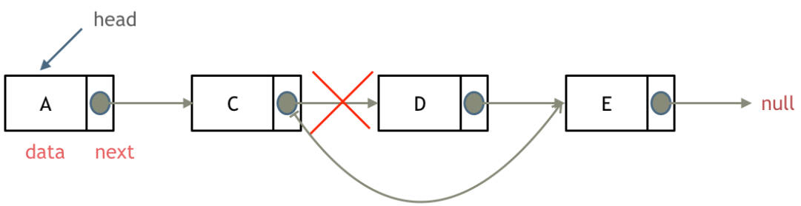
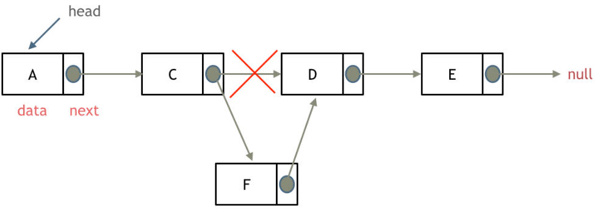

# LeetCode_Log

> Ref：[代码随想录](https://programmercarl.com/)

[C++ 代码风格指南](https://zh-google-styleguide.readthedocs.io/en/latest/google-cpp-styleguide/)

## 1.算法性能分析

算法复杂度的排行：$O(1)$常数阶 < $O(\log n)$对数阶 < $O(n)$线性阶 < $O(n \log n)$线性对数阶 < $O(n^2)$平方阶 < $O(n^3)$立方阶 < $O(2^n)$指数阶

### 1.1 时间复杂度

时间复杂度描述算法的运行时间，通常是估算法的**操作单元数量**代表程序消耗的时间，默认 CPU 的每个单元运行消耗时间是相同的。

**1.大 O 的意义**

- **最坏情况运行时间的上界。**
- **数据规模突破到一定的数量级，即此时常数项的系数已经不起决定性作用。**

数据用例的不一样，时间复杂度也是不同的，通常关心的是一般情况下的时间复杂度。如快速排序默认的时间复杂度为 $O(n \log n)$。

**2.不同数据规模的差异性**

算法复杂度默认是忽略常数项（但要注意大常数的问题，如 $10^7,10^8$ 等），例如 $O(100n)$ 变为 $O(n)$，$O(5n^2)$ 变为 $O(n^2)$。选择算法的时候要注意多个指标，不是仅根据时间复杂度的高低判断优劣，还要注意**数据规模**的影响。

### 1.2 如何计算

例：计算 $O(2*n^2 + 10*n + 1000)$ 

1. 简化去掉**常数项**，其不会随着 $n$ 的增大而增大
2. 去掉**常数项系数**
3. 只保留最高项 **$n^2$**

或对式子进行缩放操作：$O(2*n^2 + 10*n + 1000) < O(3*n^2)$

最终的时间复杂度就是 $O(n^2)$。

**$O(\log n)$ 的对数底数**：忽略了底数的取值。因为 $\displaystyle \frac{\log_i n}{\log_ij}=\log_j n$，且大 $O$ 表示法忽略了常数项系数 $\log_i j$ ，故可认为**底数不同的情况下结果却是相同**。

### 1.3 LeetCode 超时问题

一般 OJ（online judge）的超时时间是 1s。

**硬件解读计算机运行速度**

CPU配置：2.7 GHz Dual-Core Intel Core i5 

1Hz = 1/s，1Hz 是 CPU 的一次脉冲（可以理解为一次改变状态，也叫时钟周期），称之为赫兹，那么1GHz = $10^9$ Hz，即 10 亿 HZ。

### 1.4 空间复杂度

运行过程中占用内存空间大小的度量。空间复杂度 (Space Complexity) 记作 S(n) 依然使用大 O 来表示。

需要注意的是，这里的空间复杂度是考虑**运行时占用内存的大小，而不是可执行文件的大小**。

空间复杂度要求对算法占用的内存有个大概的估量。

### 1.5 递归算法的复杂度

**1.时间复杂度**

**递归的次数×每次递归的时间复杂度**

将常规的 $O(n)$ 复杂度变为 $O(\log n)$ 形式：

```c++
#include <iostream>
using namespace std;

// 求 x 的 n 次方 O(logn)
int function1(int x, int n) {
    if (n == 0) return 1;
    if (n == 1) return x;
    int temp = function1(x, n / 2);
    if (n / 2 == 1) {
        return temp * temp * x;
    }
    return temp * temp;
}

int main() {
    long long results;
    results = function1(5, 10);
    cout << results << endl;
}
```

**2.空间复杂度**

**每次递归的空间复杂度×递归深度**

以斐波那契数列为例：

**每次递归的空间**复杂度为 $O(1)$，是一个常量。深度为 $n$ 时，即求第 $n$ 个斐波那契数列，空间复杂度就是 $O(n)$。

```c++
int fabonacci(int i) {
    if (i == 0) return 0;
    if (i == 1) return 1;
    return fabonacci(i-1) + fabonacci(i-2);
}
```

递归树分析：每个节点就是一个递归过程。


**综合比较**

使用递归算法并不一定在性能上是最优的，但可以**简化代码层面的复杂度**。

| 求解方法     | 时间复杂度 | 空间复杂度 |
| ------------ | ---------- | ---------- |
| 非递归       | $O(n)$     | $O(1)$     |
| 递归         | $O(2^n)$   | $O(n)$     |
| 优化递归算法 | $O(n)$     | $O(n)$     |

二分法：对与 C++ 来说，每一层递归共用一块数组空间，且该空间存储的是数组的地址。

- 时间复杂度 $O(\log n)$
- 空间复杂度 $O(\log n)$

### 1.6 代码的内存管理

以 C/C++ 编译程序为例：

- 栈区(Stack) ：由编译器自动分配释放，存放函数的参数值，局部变量的值等，其操作方式类似于数据结构中的栈。
- 堆区(Heap) ：一般由程序员分配释放，若程序员不释放，程序结束时可能由 OS 收回。
- 未初始化数据区(Uninitialized Data)： 存放未初始化的全局变量和静态变量。
- 初始化数据区(Initialized Data)：存放已经初始化的全局变量和静态变量。
- 程序代码区(Text)：存放函数体的二进制代码。


代码区和数据区所占的空间是固定的，空间也很小。

在可变部分中，栈区的数据在代码执行结束后，系统会自动回收；而堆区间数据需要手动回收。

**指针的空间**

指针用于寻址，对于 32 位操作系统，指针占用 4 个字节，每个字节 8 bit。而对于 64 位的操作系统，要寻找全部的内存地址，需要使用 8 字节的指针。

**内存对齐**

对于**跨平台的编程语言**都有内存对齐，如 C/C++，Java，Python等，**编译器一般都会进行内存对齐的操作**。

使用内存对齐的原因：

1. 平台原因：不是所有的硬件平台都能访问任意内存地址上的任意数据，某些硬件平台只能在某些地址处取某些特定类型的数据，否则抛出硬件异常。为了同一个程序可以在多平台运行，需要内存对齐。
2. 硬件原因：经过内存对齐后，CPU访问内存的速度大大提升

## 2.数组

- 存放在连续空间上相同类型数据的集合。
- 数组中的元素不能直接删除，只能覆盖。

### 1.二分法

[704. 二分查找](https://leetcode.cn/problems/binary-search/)

使用 `>>1` 相当于除以 2；右移操作，如 1010 >> 1 => 0101

**优点：**

- 避免和会超过基本类型所能容纳的最大值；

- 而且 **>>** (位运算) 比 **/** 运算要快一点；

```c++
left + ((right -left) >> 1) ==> left + ((right -left)/2)
==> left + right/2 -left/2 ==> left/2 + right/2 ==> (left + right) /2
```

### 2.移除元素-双指针

[27. 移除元素](https://leetcode.cn/problems/remove-element/)

**技巧**

- i++ 即后加加，原理是：先自增，然后返回自增之前的值
- ++i 即前加加，原理是：先自增，然后返回自增之后的值

**描述：**

一个数组 `nums` 和一个值 `val`，你需要 原地 移除所有数值等于 `val` 的元素，并返回移除后数组的新长度,不要使用**额外的数组空间**，你必须仅使用 `O(1)` 额外空间并 原地 修改输入数组。

元素的顺序可以改变，且不需要考虑数组中超出新长度后面的元素。

```text
输入: nums = [-1,0,3,5,9,12], target = 9
输出: 4
解释: 9 出现在 nums 中并且下标为 4

输入: nums = [-1,0,3,5,9,12], target = 2
输出: -1
解释: 2 不存在 nums 中因此返回 -1
```

**Solution Code：**

```c++
//双向指针，同向移动
class Solution01 {
public:
    int removeElement01(vector<int>& nums, int val){
        int left_index = 0;
        int right_index = nums.size() -1;
        while(left_index <= right_index) {
            // 直到找到相等的
            while(left_index <= right_index && nums[left_index] != val) {
                left_index++;
                // ++left_index;
            }
            // 直到找到不相等的
            while(left_index <= right_index && nums[right_index] == val) {
                right_index--;
                // --right_index;
            }
            if (left_index < right_index) {
                // nums[left_index++] = nums[right_index--];
                nums[left_index] = nums[right_index];
                left_index++;
                right_index--;
            }
        }
}
};
```

### 3.序数组的平方-双指针

[977. 有序数组的平方](https://leetcode.cn/problems/squares-of-a-sorted-array/)

 **描述：**

**非递减顺序** 排序的整数数组 `nums`，返回 **每个数字的平方** 组成的新数组，要求也按 **非递减顺序** 排序。

时间复杂度为 O(n) 的算法解决本问题

```text
输入：nums = [-4,-1,0,3,10]
输出：[0,1,9,16,100]
解释：平方后，数组变为 [16,1,0,9,100]
排序后，数组变为 [0,1,9,16,100]
```

**Solution Code：**

```c++
class Solution {
public:
    vector<int> sortedSquares(vector<int>& nums) {
        int array_size = nums.size();
        int index = array_size - 1;
        int right = index;

        vector<int> result(array_size, 0);
        for (int left =0; left <= right;){
            if(nums[left] * nums[left] >= nums[right] * nums[right]){
                result[index] = nums[left] * nums[left];
                left++;
            }
            else{
                result[index] = nums[right] * nums[right];
                right--;
            }
            index--;
        }
        return result;
    }
};
```

### 4.长度最小的子数组-滑动窗口

[209. 长度最小的子数组](https://leetcode.cn/problems/minimum-size-subarray-sum/)

**描述：**

给定一个含有 n 个正整数的数组和一个正整数 target 。

找出该数组中满足其和 `≥ target` 的长度最小的连续子数组 `[numsl, numsl+1, ..., numsr-1, numsr] `，并返回其长度。如果不存在符合条件的子数组，返回 0。

```text
输入：target = 7, nums = [2,3,1,2,4,3]
输出：2
解释：子数组 [4,3] 是该条件下的长度最小的子数组。

输入：target = 4, nums = [1,4,4]
输出：1

输入：target = 11, nums = [1,1,1,1,1,1,1,1]
输出：0
```

**Solution Code：**

**滑动窗口法：**

不断调整调整子序列的**起始位置和终止位置。**用一个 `for` 循环表示**终止位置**，

```c++
#include <iostream>
#include <vector>
using namespace std;

class Solution {
public:
    int minSubArrayLen(int target, vector<int>& nums) {
        int result = INT32_MAX; //初始值定义为32位最大值
        int i = 0; //其实位置
        int sum = 0;
        int subLength = 0;

        for (int j = 0;j < nums.size();j++) {
            sum += nums[j];
            // 大于目标值，起始位置向前移动, 用wile而不是if
            while (sum >= target) {
                subLength = j - i + 1;
                result = result > subLength ? subLength:result;
                sum -= nums[i];
                i++;
            }
        }
        return result == INT32_MAX ? 0:result;
    }
};

int main() {
    Solution solv;
    int target = 7;
    int demo_array[6] = {
        2,3,1,2,4,3
    };
    
    vector<int> nums(demo_array, demo_array + 6);
    int temp = solv.minSubArrayLen(target, nums);
    cout <<"输出结果为:" << temp << endl;
}
```

### 5.螺旋矩阵-循环不变量

[59. 螺旋矩阵 II](https://leetcode.cn/problems/spiral-matrix-ii/)

**描述：**

给你一个正整数 `n` ，生成一个包含 `1` 到 `n2` 所有元素，且元素按顺时针顺序螺旋排列的 `n x n` 正方形矩阵 `matrix`

```text
输入：n = 3
输出：[[1,2,3],[8,9,4],[7,6,5]]

输入：n = 1
输出：[[1]]
```


**Solution Code：**

```c++
class Solution{
public:
    // 返回值类型为二维的嵌套数组
    vector<vector<int>> generateMatrix(int n) {
        vector<vector<int>> res(n, vector<int>(n, 0));
        int startx = 0, starty = 0;
        // int loop = n % 2 ? n/2 +1 : n/2;
        int loop = n / 2;
        int mid = n / 2;
        int offset = 1; //n-offset控制每条边的遍历长度
        int count = 1;
        int i,j;

        while(loop --){
            i = startx;
            j = starty;

            // 行数不变
            for (i = startx; i < n - offset; i++) {
                res[startx][i] = count++;
            }
            // 列数不变
            for (j = starty; j < n - offset; j++) {
                res[j][i] = count++;
            }
            // 行数不变
            for (; i > startx; i--) {
                res[j][i] = count++;
            }
            for (; j > starty; j--) {
                res[j][i] = count++;
            }

            // 起始位置移动
            startx++;
            starty++;
            offset++;
        }
        if (n % 2){
            res[mid][mid] = count;
        }
        return res;
    }
};
```

### 总结

- 下标从 0 开始
- 存储空间连续，只能覆盖
- 针对 `C++` 而言，vector 的底层实现是 array，严格来讲 vector 是容器，不是数组。

## 3.链表

### 概述

不连续存储，取决于内存管理方式。

**链表的分类**

单链表：


双链表：


循环链表：


### 链表定义

```c++
//单链表
struct ListNode {
    int val;
    ListNode* next;
    ListNode(int x) : val(x), next(NULL) {}//节点构造函数
};
```

也可以不使用自定义构造函数，使用默认生成的，但是默认生成的构造函数不能直接初始化任何变量。

```c++
//自定的构造函数
ListNode* node = new ListNode(5);

//使用默认的初始化,间接赋值初始化
ListNode* node = new ListNode();
node->value = 5;
```

**Java 版本**

```java
public class ListNode {
    // 结点的值
    int val;

    // 下一个结点
    ListNode next;

    // 节点的构造函数(无参)
    public ListNode() {
    }

    // 节点的构造函数(有一个参数)
    public ListNode(int val) {
        this.val = val;
    }

    // 节点的构造函数(有两个参数)
    public ListNode(int val, ListNode next) {
        this.val = val;
        this.next = next;
    }
}
```


### 链表操作

**删除链表**



注意：C++ 后续需手动释放删除列表的内存，Java，Python 则有自动回收机制。

**添加列表**



| 时间复杂度 | 增/删 | 查询 | 适用                           |
| ---------- | ----- | ---- | ------------------------------ |
| 数组       | O(n)  | O(1) | 数据量固定，查询频繁，增删少   |
| 列表       | O(1)  | O(n) | 数据量不固定，查询少，增删频繁 |

### 6.移除指定的链表元素

[203. 移除链表元素](https://leetcode.cn/problems/remove-linked-list-elements/)

**描述**

链表的头节点 `head` 和一个整数 `val` ，请你删除链表中所有满足 `Node.val == val` 的节点，并返回 **新的头节点**

```text
输入：head = [1,2,6,3,4,5,6], val = 6
输出：[1,2,3,4,5]

输入：head = [], val = 1
输出：[]

输入：head = [7,7,7,7], val = 7
输出：[]
```

**Solution Code：**

```c++
#include <iostream>
#include <vector>
using namespace std;

// 自定义链表形式
struct ListNode {
    int val;
    ListNode* next;
    // 成员初始化列表
    ListNode(): val(0), next(nullptr) {}
    ListNode(int x): val(x), next(nullptr) {}
    ListNode(int x, ListNode* next): val(x), next(next) {}

};

class Solution {
public:
    ListNode* removeElements(ListNode* head, int val) {
        ListNode* dummyHead = new ListNode(0); //设置虚拟头结点
        dummyHead->next = head;
        ListNode* cur = dummyHead;
        while(cur->next != NULL) { 
            if(cur->next->val == val) {
                ListNode* tmp = cur->next;
                cur->next = cur->next->next;
                delete tmp;
            }
            else {
                cur = cur->next;
            }
        }
        // 最后将辅助作用的虚拟节点删除
        head = dummyHead->next;
        delete dummyHead;
        return head;
    }
};
```

### 7.


