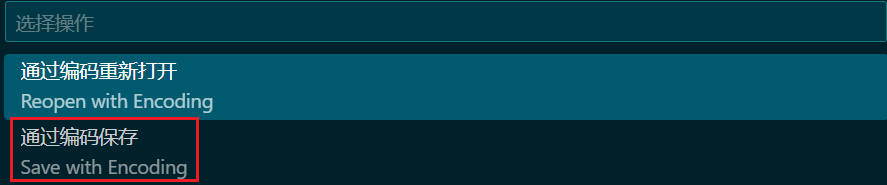

### VsCode 终端中文乱码解决方案

**问题描述**

以下为一个简单的 `c++` 文件代码，注意中文部分的显示内容

```c++
//测试代码
#include <stdio.h>

int main()
{ 
    int y = 10;
    int count = 0;
    while (y--) {
        ++count;
        printf("第%d次:y=%d\n", count, y);
    }
    printf("最后y的值:%d\n", y); 
    return 0;
}
```

未解决前的出现的乱码问题：


**解决方案(只针对改动的文件生效)：**

1. 点击红框所示的： `UTF-8`

2. 在弹出的窗口中选择 "通过编码保存"

   

3. 搜索 `gbk` 并选择该选项，选择后可以看到右下角显示的也变为 `GBK`（如红框所示）

   

   

4. 此时再次运行，发现终端已不再生成乱码

   

**其他问题**

对于在状态栏中找不到文件编码显示的情况，可右键单击底部状态栏的空白处，选择红框中的选项即可

